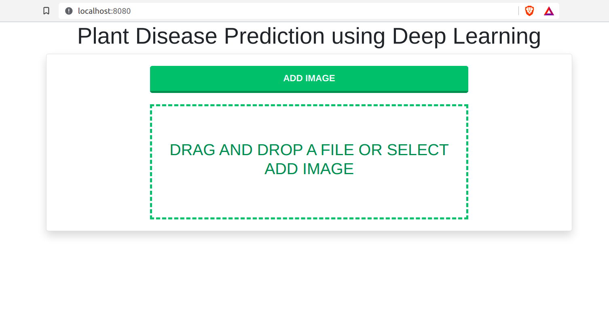
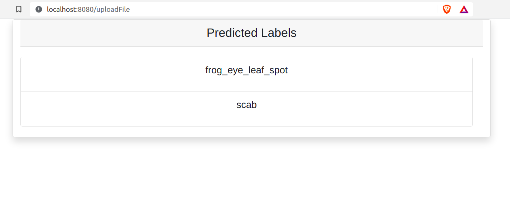

# Plant Disease Prediction
* This is a simple **Spring Boot** Web Application. This application provides a user interface to upload an image of a plant and get appropriate labels.
* I have deployed a deep learning model which we have developed and trained during kaggle plant pathology 2021 FGVC8 competition.
* Following are the labels predicted by the model:
    * healthy
    * scab
    * frog_eye_leaf_spot
    * rust
    * powdery_mildew
    * complex
    
* This was a **multi-label classification** problem. 'complex' is a special label, because model gives output as complex when it detects disease on the plant leaf which are not the labels on which model is trained on.
* The model is trained on dataset given in the competition which consists of around 18k images of apple leaves. This is the [link](https://www.kaggle.com/c/plant-pathology-2021-fgvc8/overview) of the competition.
* We had **fine-tuned EfficientNetB7** pretrained model on the given dataset on TPU with custom learning rate scheduler. We had tried many approaches but this gives us the highest **Mean-F1-Score of 0.835** on the private test set on kaggle.
* I had deployed this model on the spring-backend using **DJL (Deep Java Library)** [Documentation](https://docs.djl.ai/). This is very effective tool for deploying ML/DL models on Java back-end.
* I converted my `.h5` model into `.pb` file using `tf.saved_model.save`. Link to the [Documentation](https://www.tensorflow.org/api_docs/python/tf/saved_model/save).
* I have used **Thymeleaf** template engine to render the HTML on the browser.
* I have also deployed this application on Aws EC2 instance but due to free account I didn't deploy it for forever.
* User can select image from the local device and upload the image and get the labels for the uploaded plant image.
* We can easily configure the model parameters by overriding parameters defined in `application.properties` by command line argument or by environment variables.
* I had also included jupyter notebook files for model training in the repository.

Additional features that I will implement in the future: 
* Batch processing functionality (Process entire folder consisting of multiple images).
* Implement feature to download CSV file consisting of uploaded image name and corresponding labels.

### ScreenShots

